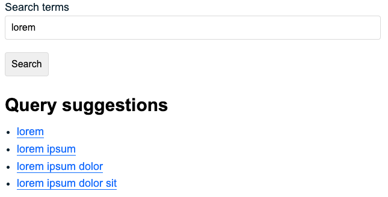
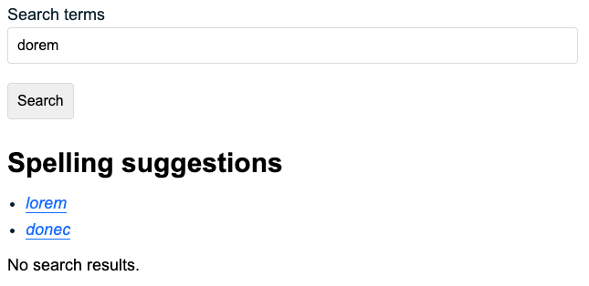

Once you have added your content as [Documents](/features/documents-and-files/) to an [Engine](/features/engines-and-schema) you can use the powerful query and filtering features below to deliver the relevant content to your users quickly.

## Querying

Performing a search has at its core a **query**. This is usually a word or phrase that a user wants information about. Silverstripe Search takes the query and finds documents that have content matching that it. For example, your user may make a query for contact address in order to find a page on your site that contains your organisation’s physical address.

By default Silverstripe Search will match the query to the content of all the fields in your document. This can be customised - for more information see the [Developer's guide](/developers-guide).

A query can consist of multiple **terms** (even multi-word terms), which can be combined using special syntax (operators). By default Silverstripe Search will match any terms in your query (although the more complete the match the higher the [**document score**](/features/relevancy#relevance-score) of the result). Search behaviour can be changed using special syntax (operators):

<table class="table table-bordered">
  <thead class="table-light">
    <tr>
      <th scope="col">Syntax</th>
      <th scope="col">Effect</th>
    </tr>
  </thead>
  <tbody>
    <tr>
      <td>Double quoted strings   e.g. contact <code>"street address"</code></td>
      <td>Text within double quotes will be matched as one term. In this example rather than matching just <code>street</code> or <code>address</code>, the document must match <code>street address</code>.</td>
    </tr>
    <tr>
      <td>Operator <code>AND</code>  e.g. <code>engineering AND chemical</code></td>
      <td>The <code>AND</code> operator matches documents where both terms exist in the document fields.</td>
    </tr>
    <tr>
      <td>Operator <code>NOT</code>  e.g. <code>engineering NOT chemical</code></td>
      <td>The <code>NOT</code> operator excludes documents that contain the term after <code>NOT</code>.</td>
    </tr>
    <tr>
      <td>Operator <code>+</code>  e.g. <code>wheel +square</code></td>
      <td>Requires the term right after the <code>+</code> to be in the matching document.</td>
    </tr>
    <tr>
      <td>Operator <code>-</code>  e.g. <code>wheel -square</code></td>
      <td>Prohibits the term right after the <code>-</code> from being in the  document.</td>
    </tr>
  </tbody>
</table>

> [!WARNING]
> Some relevance tuning settings do not support this special syntax.
>

## Sorting

By default Silverstripe Search will calculate a [document score](/features/relevancy#relevance-score) for how well a document matches your query. Results with the highest score will be returned first. You can choose a different order by sorting on a different field. Different field types can be sorted in [type-specific](/features/documents-and-files/) ways:

-   `text`: Can be sorted alphanumerically
-   `number`: Can be sorted numerically
-   `date`: Can be sorted historically
-   `geolocation`: Can be sorted by distance to a provided geographical point.

Sorting can be done against multiple fields, ascending or descending.

## Filters

A common requirement for search is to match a subset of your overall content. For example, you may want a search box that finds only blog posts. You can use Silverstripe Search’s filters to narrow down what results are returned. This can allow you to create rich user interfaces such as product filters. There are several types available:

<table class="table table-bordered">
  <thead class="table-light">
    <tr>
      <th scope="col">Filter Type</th>
      <th scope="col">Description</th>
    </tr>
  </thead>
  <tbody>
    <tr>
      <td><code>value</code></td>
      <td>Return documents that contain a specific field value.   Available on <strong>text</strong>, <strong>number</strong>, and <strong>date</strong> fields.</td>
    </tr>
    <tr>
      <td><code>range</code></td>
      <td>Return documents over a range of dates or numbers.  Available on <strong>number</strong> or <strong>date</strong> fields.</td>
    </tr>
    <tr>
      <td><code>geo</code></td>
      <td>Return documents relative to their location.   Available on <strong>geolocation</strong> fields.</td>
    </tr>
  </tbody>
</table>

## Facets

Facets help the user discover more about your data by showing them as groups of results. A common example is a menu that might show you how many results there are within a category:

You can create facets by value which shows documents that have a matching field or by range such as documents within a specific date range.

## Results

Result fields are customisable, and can be presented as raw values or field excerpts with search terms highlighted. There are further options to customise your results in code, check out the [Developer's guide](/developers-guide).

## Suggestions

Silverstripe Search supports two types of suggestions: **query suggestions**, and **spelling suggestions**. These two features provide very different functionality, and cannot be used interchangeably.

In short:

-   Query suggestions are used to **expand** the query being made
-   Spelling suggestions are used to **correct** the query being made

### Query suggestions

Also known as “autocomplete”, “typehead”, etc.

You can send a partial query and receive a list of more specific queries that match your content. This can be used by a developer to customise their Silverstripe CMS application by building an autocomplete box to help users complete their search faster.

**Importantly**: Query suggestions will **not** fix spelling errors. Query suggestions are provided based on the exact query being made.

### Spelling suggestions

Also known as “spellcheck”, “did you mean?”, etc.

You can send a query and receive a list of spelling suggestions that match your content. This feature can be used in many ways, but is commonly used when the end user performs a search that returns no results.

**Importantly**: If everything is spelled correctly in the query (based on your content), you are unlikely to receive spelling suggestions.
