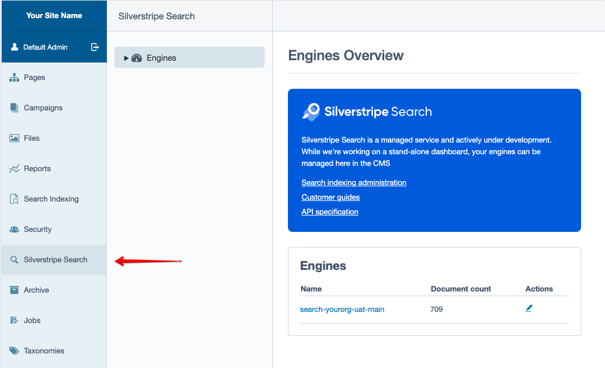
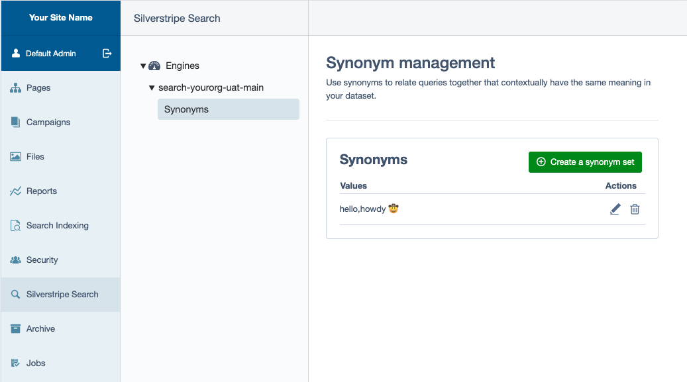

title: Synonyms

Features on this page are only supported on plans with Analyst features. For more information, refer to [Features]({filename}/pages/features.md)

You can add synonyms for queries that have the same meaning in your content. Your content may use different terminology than your users, and synonyms can help to direct them.

For example, users might search for _“Cellphone”_ but your content writers have guidelines to use the **term** _“Mobile”_. If you add a synonym set with these two terms then searching for either term will match documents with _“Mobile”_ or _“mobile”_.

You can configure synonyms using the API or via the Silverstripe Search Admin module that comes with the SDK - refer to the [Developer's guide]({filename}/pages/developers-guide.md) for more information and installation instructions.

## Administration module

Synonyms can be managed in the [Silverstripe Search Administration module](https://github.com/silverstripeltd/silverstripe-bifrost-admin). Once installed it is available in the CMS menu:

After selecting your engine you can create, update and delete synonym sets:

